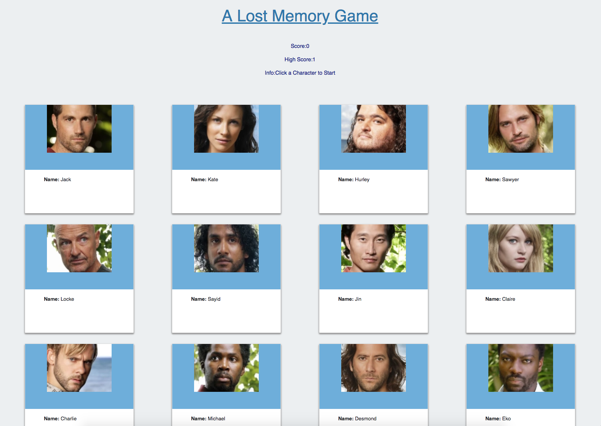

# Lost Memory Game
This game was built using React.

## Game Play
Click one of the characters from Lost and try to remember who you selected. The cards will shuffle around. If you pick the same person twice the game starts over. No time travel and there is no Man in Black to confuse you, just Locke. Absolute high score is 12. If you win, you can click a card to start playing again.

## Dumb and Smart Components
There are some "dumb" components to handle the elements rendered to the DOM. All state changes are handled by the "smart" App component. 

